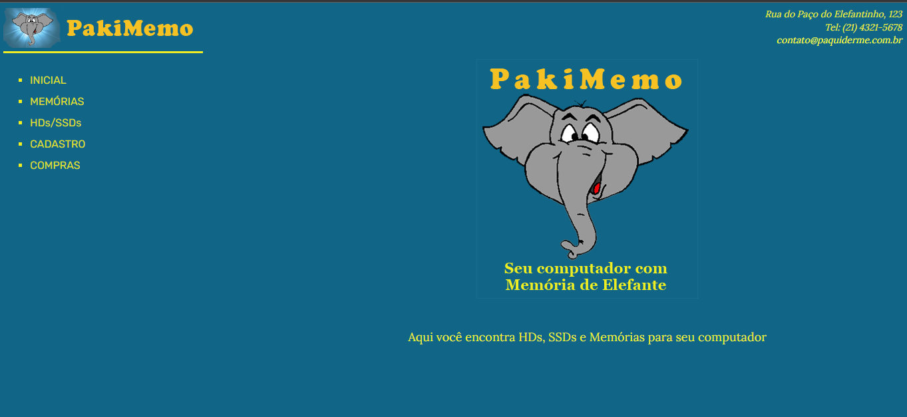
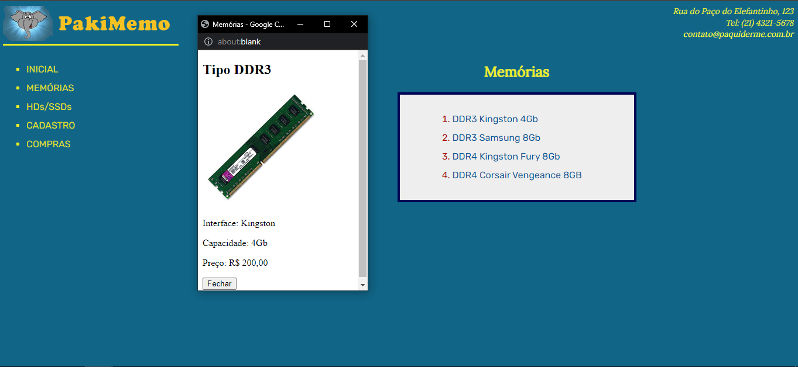
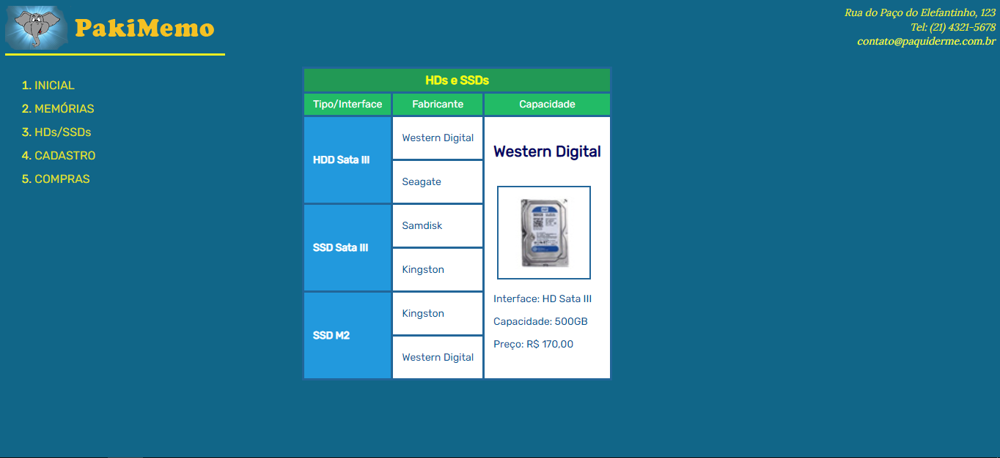
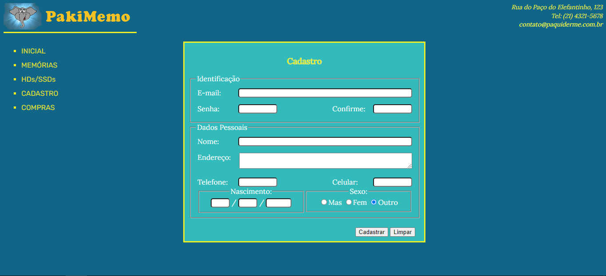
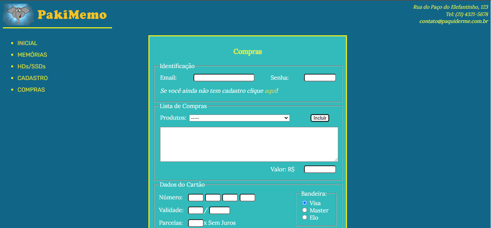

# College Project 
### Welcome to our dynamic project using HTML5, CSS3 and JavaScript! 

This is my very first college project, a simple website built using JS, HTML5 and CSS3. This project was an opportunity to showcase my web development skills and demonstrate my ability to create a dynamic and interactive website. I am confident that this experience will serve me well in future endeavors. 

# Deploy 

https://julianagagliano7.github.io/Paki-Memo/html/PakiMemo.html

